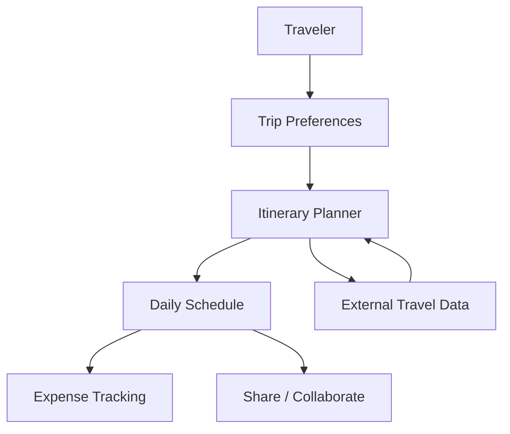
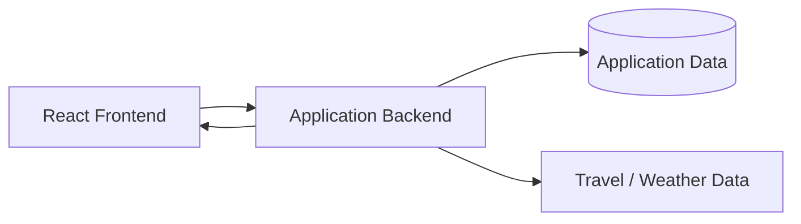

# SyntaxSquad

A dynamic travel itinerary planner built around a simple idea: make trip planning easier to organize, adjust and share.

## Product flow



## What the project explores

- Dynamic itinerary creation
- Preference-aware planning
- Budget and expense tracking
- External travel information
- Collaborative trip sharing
- Frontend and backend integration

## Architecture



## Local setup

```bash
npm install
npm start
```

Configure the required environment values for the frontend and backend before running the complete stack.

## Why I built it

A useful itinerary is more than a list of places. It has to fit a person's time, interests and budget. SyntaxSquad explores how software can make that planning process easier to adjust and share.
